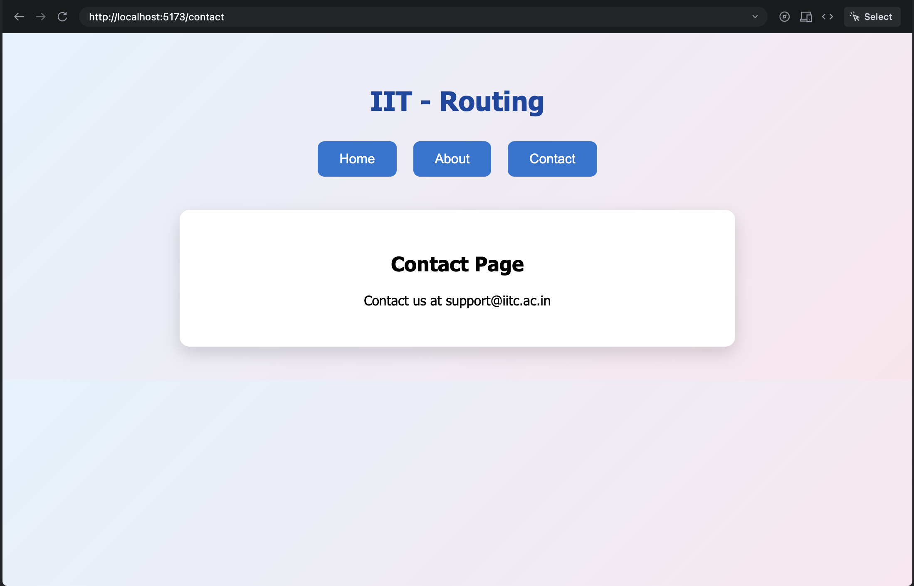
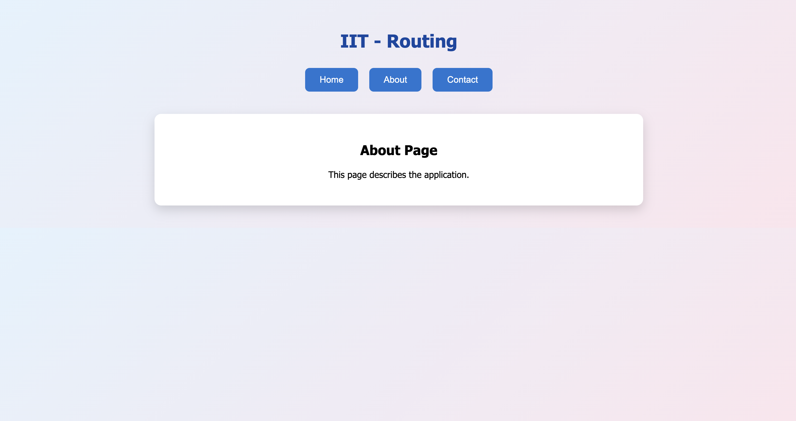
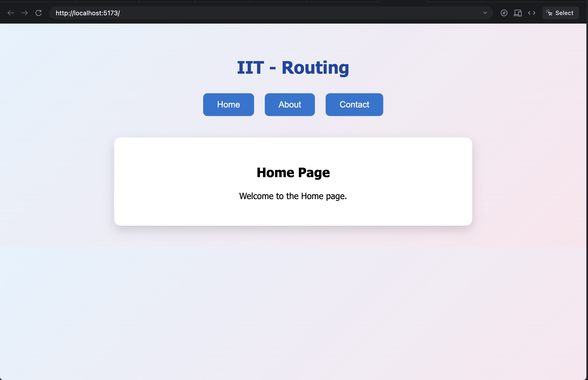
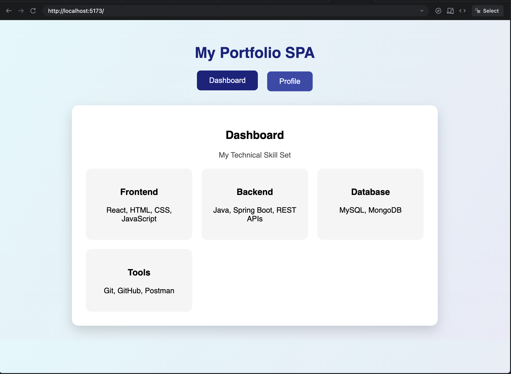
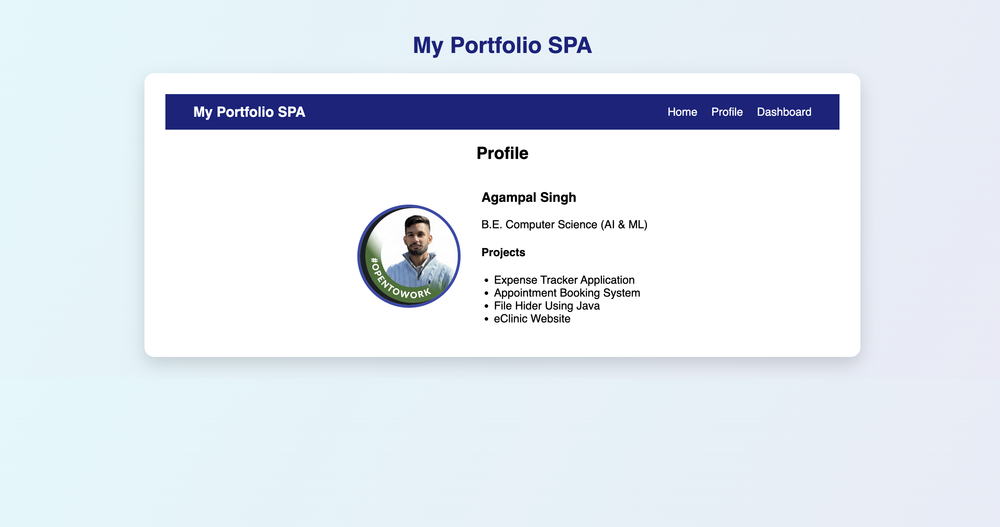
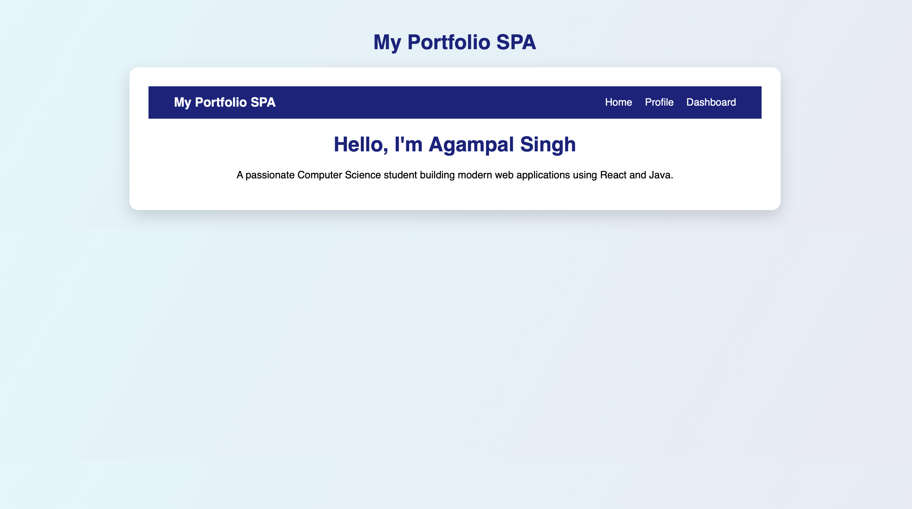

# React Router Experiments – SPA Routing Lab

This repository contains two React experiments that demonstrate **client-side routing** in **Single Page Applications (SPA)** using **React Router DOM**.

---

## 📘 Experiment–1: Basic Client-Side Routing Using React Router

### 🎯 Aim
To implement basic client-side routing in a Single Page Application using React Router.

---

### 🧠 Theory
In a Single Page Application, routing allows navigation between different views without reloading the entire page.  
React Router is a popular library used for handling routing in React applications using components such as `BrowserRouter`, `Routes`, `Route`, and `Link`.

---

### ⚙️ Procedure
1. Create a React application.
2. Install `react-router-dom`.
3. Wrap the application with `BrowserRouter`.
4. Define routes using `Routes` and `Route`.
5. Navigate between pages without page reload.

---

### 🧪 Result
Basic routing was successfully implemented using React Router, allowing seamless navigation between multiple pages without reloading the browser.

---

## 📘 Experiment–3: Multi-Page SPA Using Routing

### 🎯 Aim
To create a multi-page Single Page Application using client-side routing.

---

### 🧠 Description
This experiment extends basic routing to build a **portfolio-style SPA** with two main pages:
- **Dashboard** – Displays technical skills in a creative card-based layout.
- **Profile** – Displays personal details and project information.

Each page is implemented as a separate component and mapped to a route.

---

### ⚙️ Procedure
1. Create multiple React components (Dashboard and Profile).
2. Map each component to a route using React Router.
3. Use navigation buttons to switch between pages.
4. Test navigation to ensure smooth page transitions without reload.

---

### 🧪 Result
A multi-page SPA was successfully developed where each component is rendered dynamically based on the route, providing a smooth and interactive user experience.

---

## 🛠️ Technologies Used
- React
- React Router DOM
- JavaScript
- HTML & CSS
- Node.js

---

## 📂 Project Structure (EXP-3.1)
src/
├── components/
│ ├── Home.jsx
│ └── Abput.jsx
  └── Contact.jsx
├── App.js
├── App.css
└── index.js

## 📂 Project Structure (EXP-3.2)
src/
├── components/
│ ├── Dashboard.js
│ └── Profile.js
├── App.js
├── App.css
└── index.js

## ▶️ Screenshots -> Exp 3-1







---

## ▶️ How to Run the Project
```bash
npm install
npm start

## The application will run on:

http://localhost:5173
